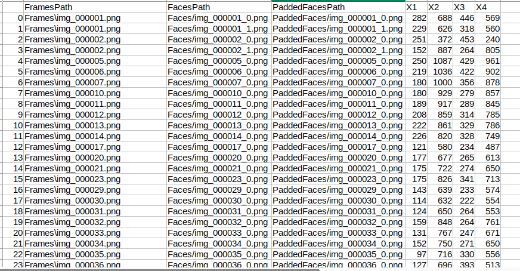
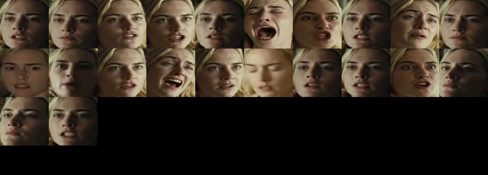
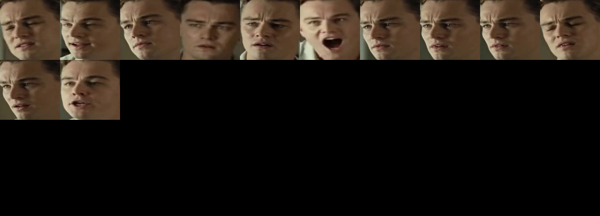
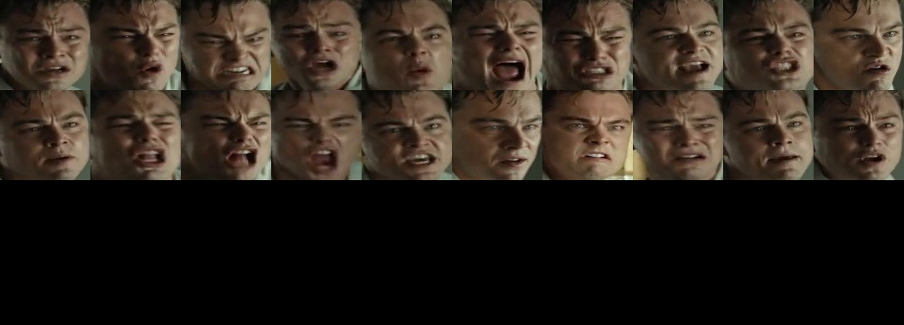
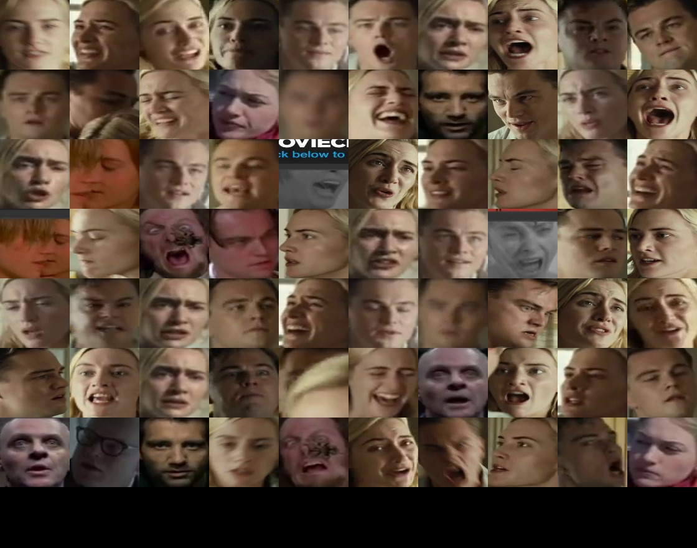
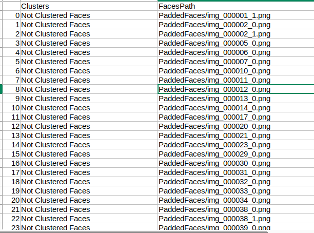
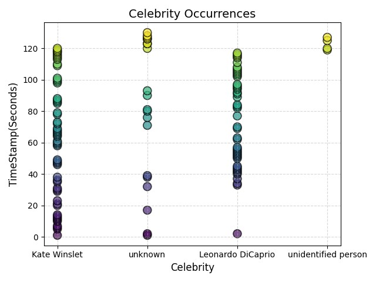
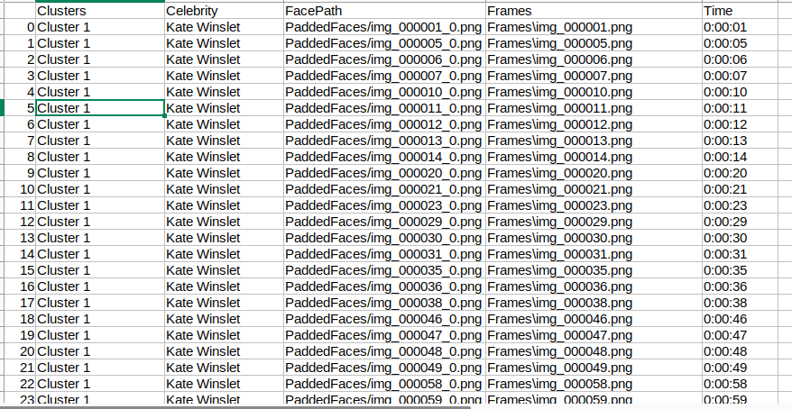

# Face Clustering
Cluster the faces using facial features or using name of the celebrities (actor/actress).

### Quick Start

```
python identifyCelebrity.py --input_video "input_video_path" --isCelebrityListAvailable "True"
```
### Details
* input_video : Input video that you want to cluster the extracted faces 
* isCelebrityListAvailable : If you have the list of celebrities (actor/actress). The celebrity lists are already saved in celebrityList.py file. If you want to add the names of additional celebrities or edit the file. You can always do that.

### Face Detection
The faces are detected using [retinaface](https://github.com/serengil/retinaface) model.

The output of the retinaface has been saved in following format


* FA1, FA2, FA3 and FA4 are the coordinates of the bounding boxes of the detected faces
* FrameFileName : Input image
* PaddedFacesPath : Extracted faces with some padding (Used by Celebrity name clustering)
* FacesPath : Extracted faces without padding (Used by face features clustering)

### Face Clustering using Facial Features
The process is as follows
* Extract the frames from video at 1 fps using ffmpeg.
* Extract the faces from images and save the cropped faces.
* Extract features from faces using [face_recognition](https://github.com/ageitgey/face_recognition) model.
* Cluster the faces using DBSCAN algorithm.

#### Input Video
https://github.com/akewarmayur/FaceClustering/assets/31464781/80c56596-c1cb-4aea-bf83-15658492f3bc

#### Output Clusters
* Cluster 1

* Cluster 2

* Cluster 3

* Unknown Cluster


#### Output CSV



### Face Clustering using Cropped Faces and name of Celebrities
The process is as follows
* Extract the frames from video at 1 fps using ffmpeg.
* Extract the faces from images and save the cropped padded faces.
* The extracted faces are then pass to [CLIP](https://github.com/openai/CLIP) model with the list of celebrities to be detected.

#### Output


#### Output CSV



### Applications
* This can be used to find the occurrences of the given face in the input video as shown in the above figure.
